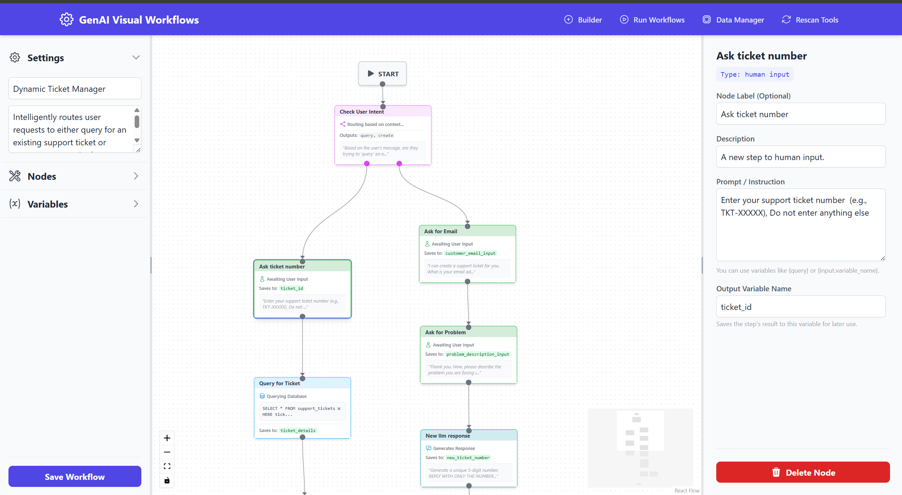

# GenAI Visual Workflows

**GenAI Visual Workflows** is a powerful, open-source platform for designing, managing, and executing complex workflows driven by Generative AI. It provides a user-friendly, drag-and-drop visual interface to build sophisticated operational flows that leverage Large Language Models (LLMs), custom Python tools, and external APIs.

This application is built with a modern tech stack, featuring a **FastAPI** backend and a **React** frontend, designed for scalability, flexibility, and ease of use.


## ✨ Key Features

*   **Visual Workflow Builder:** An intuitive drag-and-drop canvas (powered by React Flow) to design complex workflows with nodes, edges, and branching logic.
*   **Extensible Node System:** A rich set of pre-built nodes for a wide variety of tasks:
    *   **AI & Logic:**
        *   `Tool/Agent`: An agentic node that can intelligently select from a set of tools to achieve a goal.
        *   `Direct Tool Call`: Deterministically execute a specific tool with mapped inputs.
        *   `LLM Response`: Generate direct, context-aware responses from an LLM.
        *   `Condition Check`: Use an LLM to evaluate complex conditions and control workflow branching (True/False paths).
        *   `Intelligent Router`: An LLM-powered node that can choose from multiple custom paths based on context.
        *   `Display Message`: Show a formatted message in the chat window without pausing.
    *   **Data & RAG:**
        *   `File Ingestion`: Pause a workflow to accept user file uploads and extract text from various formats (PDF, DOCX, TXT, images).
        *   `Vector Ingestion`: Process and ingest text data into a FAISS vector store for retrieval.
        *   `Vector Query`: Search a vector store for relevant documents based on a query.
        *   `Re-Rank Results`: Use a Cross-Encoder to improve the relevance of search results.
    *   **Databases:**
        *   `Database Save`: Ingest or update data into a SQLite database table using an upsert operation.
        *   `Database Query`: Execute a parameterized SQL query against the SQLite database to fetch results.
    *   **Human-in-the-Loop:**
        *   `Human Input`: Pause execution to ask the user for text input.
        *   `File Storage`: Pause to accept user file uploads and save them to a designated server path.
    *   **Flow Control:**
        *   `Run Workflow`: Execute other saved workflows as sub-routines, enabling modular and reusable designs.
        *   `Start Loop`: Iterate over a collection (list) from a previous step's output.
        *   `End Loop`: Marks the end of a loop iteration and aggregates results.
    *   **External Integrations:**
        *   `API Request`: Make GET, POST, PUT, etc., requests to external APIs with dynamic data from your workflow.
*   **Dynamic Tool Discovery:** Simply drop Python files with `@tool`-decorated functions into a directory, and the system automatically discovers them, generates their schemas, and makes them available to the AI Agent and Direct Tool Call nodes.
*   **Hot-Reloading Tools:** A "Rescan Tools" button on the UI allows you to add or update tools without restarting the server.
*   **Interactive Workflow Executor:** A chat-based interface to run, test, and interact with your workflows in real-time.
*   **Data Manager UI:** A dedicated view to inspect the application data's SQLite database schema and execute raw SQL queries for administration and debugging.
*   **Persistent Storage:** Workflows are saved to a durable SQLite database, preserving your designs, while a separate database handles application data.
*   **Modern, Robust Tech Stack:**
    *   **Backend:** FastAPI, Pydantic for data validation, and a clean, decoupled architecture.
    *   **Frontend:** React, Vite, Zustand for state management, and Tailwind CSS for a polished UI.

## 🏛️ Architecture Overview

The project is structured as a monorepo with two main components: `backend` and `frontend`.

*   **`backend/`**: A Python application built with **FastAPI**.
    *   `main.py`: The main API server, handling HTTP requests for workflows, executions, tools, and the data manager.
    *   `config.py`: Centralized application configuration using Pydantic, loaded from a `.env` file.
    *   `genai_workflows/`: The core engine of the application.
        *   `core.py`: `WorkflowEngine` orchestrates all components.
        *   `executor.py`: The state machine that runs the workflows, dispatching tasks to action-specific executors.
        *   `actions/`: Contains the execution logic for each node type (e.g., `LlmResponseAction`, `HttpRequestAction`).
        *   `storage.py`: Manages the SQLite database for storing workflow definitions and paused states.
        *   `database_manager.py`: Manages the application's data-specific SQLite database.
    *   `tools/`: Directory for housing all discoverable tools.
        *   `decorator.py`: Defines the `@tool` decorator.
        *   `loader.py`, `registry.py`: The system for dynamically finding, parsing, and loading tools.
        *   `builtin/`, `custom/`: Drop your custom tool files here.

*   **`frontend/`**: A JavaScript application built with **React** and **Vite**.
    *   `src/views/`: Contains the main page components (`WorkflowBuilder`, `WorkflowExecutor`, `DataManager`).
    *   `src/components/`: Reusable UI components.
        *   `nodes/`: Defines the visual appearance and inspector panel logic for each workflow node type.
        *   `ui/`: Sidebar, Inspector Panel, Accordion items, etc.
    *   `src/stores/`: Global state management with **Zustand**.
    *   `src/hooks/`: Custom React hooks for fetching data and managing chat logic.

## 🛠️ Setup and Installation

Follow these instructions to get the project running on your local machine.

### Prerequisites

*   **Python 3.11+** and `pip`.
*   **Node.js 22+** and `npm`.

### 1. Clone the Repository

```bash
git clone https://github.com/anuj67851/genai-workflow-maker.git
cd genai-workflow-maker
```

### 2. Configure Environment Variables

The application uses a `.env` file for configuration.

1.  Create a `.env` file in the root directory by copying the example:
    ```bash
    cp .env.example .env
    ```
2.  Open the newly created `.env` file and add your **OpenAI API Key**. The other variables are pre-configured for local development.

    ```dotenv
    # Required: Add your OpenAI API Key
    OPENAI_API_KEY="sk-..."
    
    # Optional: Base URL for the mock email API endpoint used by some tools
    INTERNAL_API_BASE_URL="http://localhost:8000"
    ```

### 3. Backend Setup

Set up and run the Python backend server.

```bash
# Create and activate a virtual environment (recommended)
python -m venv venv
source venv/bin/activate  # On Windows, use `venv\Scripts\activate`

# Install Python dependencies from the provided requirements file
pip install -r backend/requirements.txt
```

### 4. Frontend Setup

Set up and run the React frontend. Open a **new terminal window** for this process.

```bash
# Navigate to the frontend directory
cd frontend

# Install JavaScript dependencies
npm install
```

## 🚀 Running the Application

You need to have both the backend and frontend servers running simultaneously.

1.  **Start the Backend Server:**
    In your first terminal (in the project root with the virtual environment activated):
    ```bash
    uvicorn backend.main:app --reload
    ```
    The backend API will be running at `http://localhost:8000`.

2.  **Start the Frontend Server:**
    In your second terminal (inside the `frontend` directory):
    ```bash
    npm run dev
    ```
    The frontend development server will start, typically at `http://localhost:5173`. The Vite configuration is already set up to proxy API requests to your backend.

**You can now access the application by navigating to `http://localhost:5173` in your web browser!**

## 📖 How to Use

### Building a Workflow
1.  Navigate to the **Builder** view.
2.  On the left sidebar, give your workflow a **Name** and **Description**.
3.  Drag nodes from the "Nodes" list onto the canvas.
4.  Connect the nodes by dragging from the handles (circles) on one node to another.
5.  Click on a node to select it. The **Inspector Panel** on the right will show its properties.
6.  Configure each node's properties, such as prompts, output variable names, API URLs, or tool selections.
7.  Once your design is complete, click **Save Workflow**.

### Running a Workflow
1.  Navigate to the **Run Workflows** view.
2.  Select a saved workflow from the list.
3.  A chat interface will appear. Type your initial query to start the workflow.
4.  Follow the prompts from the workflow. If it pauses for human input or a file upload, the input area will change accordingly.

### Adding a New Custom Tool
1.  Create a new Python file in `backend/tools/custom/` (e.g., `my_new_tools.py`).
2.  Inside the file, define a Python function with type hints and a descriptive docstring.
3.  Add the `@tool` decorator above your function.
    ```python
    # backend/tools/custom/my_new_tools.py
    from backend.tools.decorator import tool

    @tool
    def check_weather(city: str) -> str:
        """
        Checks the current weather for a given city.
        :param city: The name of the city to check.
        :return: A string describing the weather.
        """
        # (Your implementation here)
        return f"The weather in {city} is sunny."
    ```
4.  In the web UI, click the **Rescan Tools** button in the header.
5.  Your new `check_weather` tool will now be available for selection in any `Tool/Agent` or `Direct Tool Call` node.

### Using the Data Manager
1.  Navigate to the **Data Manager** view.
2.  The left panel displays the schema of the application's data database (`application_data.db`). You can see all tables and their columns.
3.  In the main panel, write any SQL command (e.g., `SELECT * FROM users;`) in the editor.
4.  Click **Execute SQL**. The results will be displayed in the table below. This is useful for debugging and administration.

### WIP (Work In Progress)

Features that exist in the backend but are not yet fully exposed in the UI:

1.  **Interactive Parser:** A conversational interface for building a workflow using natural language.
2.  **Workflow Router:** Dynamically select and execute a workflow based on the initial user query (currently, workflows must be selected manually in the UI).

### Screenshots

**Editor View**


**Builder View**


**Execution View**
